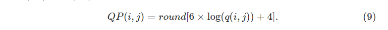
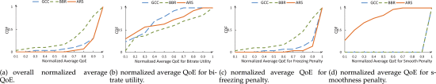

# [T-Gaming: A Cost-Efficient Cloud Gaming System at Scale](https://ieeexplore.ieee.org/abstract/document/8735806)

Abstract:

云游戏（CG）系统既可以通过密集计算来追求高质量的游戏体验，又可以通过任何能源受限的移动设备随时随地获得终极便利。尽管付出了巨大的努力，但最新的CG系统仍存在多个关键限制:昂贵的部署成本，高带宽消耗和不满意的体验质量（QoE）。结果，现有作品在现实中未被广泛采用。本文提出了一个透明的游戏框架，称为T-Gaming，该框架允许用户通过Internet即时运行任何流行的高端台式机/游戏机游戏。T-Gaming利用现成的消费类GPU，而无需借助昂贵的专有GPU虚拟化（vGPU）技术来降低部署成本。此外，它使基于人的视觉特征的优先视频编码成为可能，从而减少了带宽消耗，而视觉质量没有明显下降。最后但并非最不重要的一点是，T-Gaming采用基于深度强化学习（RL）的自适应实时流技术来改善用户的QoE。为了评估T-Gaming的性能，我们在现实世界中实现并测试了原型系统。与现有的云游戏系统相比，T-Gaming不仅将每位用户的支出减少了75％的硬件成本降低了14.3％的网络成本降低了，而且还使标准化平均QoE提升了3.6％至27.9％。

## SECTION 1 Introduction

视频游戏是一个数十亿美元的业务，2017年收入约为1090亿美元，并且在过去五年中增长了56％[1]。 随着其在世界范围内的巨大普及，游戏消费者期望在任何时间和地点不受任何限制（例如终端设备和基础网络的功能）的影响下获得高质量的游戏体验[2]。 游戏内容制作者还更喜欢使用统一的平台来分发其内容，异构用户可以即时访问它们。 但是，现有的游戏平台，例如控制台（例如Xbox，Play Station），移动设备以及个人计算机（PC），不能同时直接提供令人满意的游戏质量和移动性。 为此，提出了云游戏来提供这种无处不在的方式，其中在云上渲染游戏时将瞬时场景压缩并作为视频流传递给用户，而超轻量级终端则捕获用户输入信号（例如键盘事件，鼠标） 点击，操纵杆运动等）并发送回云进行交互[2]，[3]。

自2000年代以来，人们一直致力于云游戏，从而产生了一些知名的初创公司，例如G-cluster，OnLive，Gaikai，NVIDIA GeForce Now和最近的LiquidSky等。[2]。 研究和开发活动从体系结构设计，压缩优化，网络规划和用户体验研究等展开[4]。 但是，这些初创公司遭受高额运营成本和低体验质量（QoE）的困扰。 由于以下挑战，没有一个被证明是非常成功的，并且大获全胜。

**负担不起的商业图形虚拟化解决方案。** 现有的大多数云游戏系统都已从Citrix或VMware许可商业软件以及专业的NVIDIA GPU（例如GRID系列），以在（计算的）物理GPU硬件上启用多个虚拟GPU（vGPU）实例。 node1）。 另一种选择是强制将专用GPU传递到特定用户完全占用的每个虚拟操作系统（OS）。 两种方式都提供了非常有限的并发用户（尤其是对于GPU繁忙的游戏会话），这显然对于大规模的云部署和操作而言太昂贵了。

**严格的网络带宽要求。** 使用GPU支持的默认视频编解码器，现有的云游戏系统（例如GeForce Now2和PlayStation Now3）每位用户至少需要5 Mbps的稳定带宽，才能维持可承受质量的游戏流。 即使某些移动用户（例如下行链路）可以满足这样严格的网络带宽要求，云游戏服务平台的上行链路网络的费用对于数百万个同时进行的游戏订阅也是无法承受的（例如，单个“荣耀之王”很容易吸引更多用户） 中国大陆每天有超过5000万的活跃用户）。

**用户QoE不一致。** 由于用户的移动性和网络动态（包括网络拥塞和信道衰落），最终用户中的可用网络带宽会不时变化，从而导致QoE不一致。 为此，诸如GeForce Now的现有系统通过定期探测[5]根据网络状态反馈经验性地调整帧速率和帧大小，从而实现了非常粗略的适配。 在大多数情况下，通常采用保守性策略（例如用于压缩的自适应比特率设置）来避免视频停顿，但是当然会导致明显的视觉质量下降。 但是，由于缺乏从底层网络实时学习的有效自适应比特率算法，现有系统无法提供可接受的QoE。

在本文中，我们研究了如何降低云游戏提供商的运营成本并同时提高用户的QoE。 借助提出的基于轻量级图形容器的虚拟化技术，专用的加速方案和自学流媒体策略，我们设计了一种新型的云游戏系统，称为TransparentGaming（T-Gaming或TG）。 一方面，T-Gaming系统只需要从GPU帧缓冲区中获取渲染的音频/视频帧，而不管内容本身如何，因此，它对游戏提供者是透明的，并且通常适用于所有现有游戏（例如，控制台，PC ，手机游戏等）。 另一方面，无论基础系统如何，T-Gaming系统均可在具有网络连接，音频/视频解码，图像显示和用户界面（UI）交互的基本功能的任何设备上播放。 对用户来说透明的是，可以在任何地方，通过任何网络和在任何设备上启用游戏体验。 该系统可以轻松地在任何配备GPU的云计算节点之上实施，以为内容提供商和游戏用户提供无所不在的服务。

T-Gaming系统在功能原型中提供了集成在一起的多个关键创新，以促进大规模的实际云游戏。 为了确保大规模的T-Gaming服务，我们必须在质量，延迟和成本之间进行权衡取舍，进行精心设计。 我们的贡献主要体现在两个方面，包括系统实现和额外的算法优化. 首先，从系统实现的角度出发，提出了一种轻量级且经济的TG-SHARE，以实现OS级应用程序虚拟化，从而在不降低昂贵的基于虚拟机解决方案的情况下，以较低的运营成本提供更高的并发性。 第二，从算法角度来看，T-Gaming利用人类视觉系统（HVS）激发的重要性（即显着性）图实现了基于实时优先级的视频编码，以在不牺牲视觉质量的情况下减少总体带宽。 但是，大多数现有的显着性算法仅关心检测准确性，而不关心在云游戏场景中都至关重要的联合准确性和延迟。 此外，我们没有使用基于针对网络环境假设的简化或不准确模型的启发式算法，而是首次使用深度强化学习工具引入了自适应实时流策略，以在云游戏场景中执行自适应比特率控制。 它考虑了过去观察到的服务质量（QoS）和QoE状态，从而做出了决定，从而在各种实际网络条件下都具有强大的性能。 请注意，Pensieve [6]及其变体考虑了视频点播应用程序，而不是我们的云游戏，它具有更严格的延迟和缓冲区要求。 下面列出了这项工作中创新的更详细介绍。

**可同时运行多个游戏应用程序的轻量级虚拟化技术，称为TG-SHARE**：与现有文献中使用和讨论的传统图形虚拟化解决方案不同，在传统的图形化虚拟化解决方案中，也就是硬件层使用虚拟机管理程序和许多操作系统来支持并发用户，TG -SHARE在同一操作系统上为不同用户同时运行多个游戏应用程序（称为gApp）更具成本效益。 在TG-SHARE中，用户与应用程序之间的紧密连接是分离的。 因此，可以移除管理程序层（即，导致许可费用减少），并且仅需要一个操作系统（即，导致虚拟化开销减少）来支持并发游戏会话。 同时，TG-SHARE支持现成的消费类GPU，而无需诉诸昂贵的专有vGPU技术（例如NVIDIA GRID）来进一步降低部署成本。 通过与T-Gaming系统中的图形容器（称为AppBoX）集成，TG-SHARE最终可以通过进一步利用每个计算节点的硬件功能，将并发用户的密度平均提高5倍（并减少每位用户的花费）。

**基于人的视觉功能的优先游戏视频编码。** 与其他优先视频编码工作不同，实现了专用的加速API（称为XCODER）以根据人类的视觉感知和网络估计来自适应地压缩瞬时游戏场景。 在XCODER中，我们提出了一种基于HVS的优先视频编码模型，旨在通过首先提取用户的实时焦点，然后通过扩展[7]中提出的视觉模型，相应地在不同区域上分配不同的比特率，来找到最佳的编码参数。 优先级高的视频编码模型可确保在对延迟4敏感的云游戏场景中，编码速度和质量的平衡性能。 XCODER在显着区域放置较高的比特率，而在其他地方放置较低的比特率，以将网络带宽消耗减少14.3％，而视觉质量不会明显下降。 通过我们在动态网络下通过我们提出的强化学习策略估算的可用带宽被输入XCODER，以优化压缩流的空间，时间和幅度分辨率（STAR）[8]，[9]，[10] 提供更好的视觉质量。

**一种自适应实时流（ARS）策略，该策略使用强化学习功能来动态调整网络波动的速率。** 据我们所知，我们是第一个在延迟敏感型云游戏中使用深度强化学习（DRL）技术[6]，[11]来提高实时通信（RTC）效率的公司。 请注意，Pensieve [6]和其他后续工作主要集中在视频点播（VoD）应用程序上，而不是对延迟敏感的云游戏。 一方面，T-Gaming系统无法直接采用针对VoD案例提出的现有自适应比特率（ABR）算法。 客户端中几乎没有缓冲区，服务器中对未来视频片段信息的了解为零，这需要用于云游戏的完整的新型ARS。 另一方面，现有的实时流ABR方案从根本上讲是启发式算法，它是基于为部署环境假设的简化或不准确模型或通过试错法实现的。 相反，我们的ARS会通过观察过去决策的结果来学习做出ABR决策。 通过实时了解基础网络特性，ARS的性能优于最新算法，归一化平均QoE改进范围达到3.6％至27.9％。

通过精心的系统设计，T-Gaming可实现与最先进的商用系统相当的响应延迟，并且其响应延迟降低了60％至70％，从而胜过了著名的开源系统。 而且，每位用户的成本不到使用商业GRID技术的成本的25％。

## SECTION 2 Related Work

作为用户随时随地玩游戏的有希望的范例，云游戏吸引了学术界和工业界的兴趣。 尽管现有的云游戏解决方案可以分为两类：3D图形流[12]，[13]，[14]和视频流[15]，[16]，[17]，但是大多数云游戏系统（OnLive，Gaikai， LiquidSky，GamingAnywhere，Parsec等）在实践中采用了视频流方法。 这些系统主要关注系统虚拟化，基于优先级的视频编码，编码质量优化和自适应视频流。

**系统虚拟化旨在在单个计算节点上支持多个应用程序，以增加并发用户的密度并降低运营成本。** 大多数现有的云游戏系统，例如LiquidSky5，NVIDIA GeForce Now等，都直接使用专有的NVIDIA GRID技术使用专业的GPU设备提供vGPU [3]。 对于每个vGPU实例，为特定游戏分配了专用资源，包括CUDA内核和硬件编码加速。 另一种方法是专用的GPU直通，每个用户将仅占用一个独立的GPU芯片。 请注意，现成的消费者级别的GPU可以用于GPU直通方法。 但是，这限制了在计算节点上运行的并发用户的数量，因为对于标准机架服务器的相当大的GPU，PCI-E接口的最大数量是固定的。

通常，有两种类型的虚拟化技术可以提供多个vGPU，例如，基于虚拟机管理程序的虚拟化，例如Xen6，VMware7和KVM8。 以及操作系统级虚拟化（或称为容器），包括Linux-VServer9和OpenVZ10。 系统管理程序架构以更好的硬件独立性，数据隔离和安全性而闻名。 但是，这会导致沉重的虚拟化开销[18]，[19]，从而导致性能显着下降。 此外，用户可能需要为专有软件（例如Xen Server）的许可证支付额外费用。 对于OS级虚拟化，所有虚拟实例共享一个操作系统内核（通常为Linux），这保证了计算性能接近于本机硬件。 但是，几乎所有流行的游戏都是在Windows平台上开发和部署的。 因此，我们不能直接使用Linux容器，而是需要开发一个基于Windows OS的独立图形容器，以避免由现有管理程序解决方案（例如Xen，KVM等）引起的沉重开销。

**基于优先级的视频编码。** 许多视频标准均支持基于兴趣区域（RoI）的视频编码，以支持优先的编码优化（即，优先级较高的区域的质量更高，反之亦然）。 例如，X26411和NVENC12提供应用程序编程接口（API）以启用RoI编码。 关键问题在于RoI的定义或检测。 在云游戏场景中，有两种主要的方案来定义RoI：一种是使用（游戏引擎或人类视觉焦点的）先验知识，另一种是利用HVS的显着特征。 [20]中的工作是使用先验知识的典型示例，其中游戏引擎中的渲染信息用于区分前景（即RoI）和背景（即非RoI）。 但是这种方法需要云游戏系统干预游戏引擎，几乎所有专有视频游戏都禁止这样做，以防止作弊和版权保护。 另一个例子是通过视线追踪[7]，[21]设备得出RoI。 但是，它不适合没有配备专用凝视追踪器的主流设备（例如手机，PC等）。 相反，更多研究集中在显着性驱动的RoI检测上。 最新的显着性检测工作致力于提高静止图像[22]，[23]，[24]，[25]或视频[26]，[27]，[28]的显着性检测精度。 但是他们没有考虑检测速度或延迟，这是对延迟敏感的云游戏系统的关键因素。

编码质量优化：Wu等。 [16]提出了用于视频帧选择的自适应HFR视频流（APHIS）调度框架，以根据网络状态，输入视频数据和延迟约束最小化总失真。 刘等。 [20]引入了一种基于渲染的优先编码技术，以根据网络带宽约束来提高感知的游戏质量。 Nan等。 [29]研究了延迟率失真优化问题，该问题优化了视频流和图形流之间的源速率，以在带宽和响应延迟约束下最大程度地降低整体失真。 和艾哈迈迪等。 [30]介绍了一种用于内容适应的游戏注意力模型。 但是，这些视频比特率控制算法假定带宽用于编码质量优化。

**自适应视频流。** 现有的视频流策略主要基于HTTP协议[6]，[31]，[32]，[33]，[34]，[35]，[36]。 但是，云游戏流媒体具有高度的交互性，通常基于实时流媒体协议进行操作。 为此，在[37]中提出了谷歌拥塞控制（GCC）算法，该算法通过卡尔曼滤波的端到端延迟变化来估计可用带宽，并将带宽与自适应阈值进行比较以动态限制发送速率。 Cardwell等。 提出了另一种基于拥塞的控制算法，称为瓶颈带宽和往返时间（BBR）[38]，该算法使用TCP层的瓶颈带宽和往返传播延迟来确定可用带宽及其发送速率。 这些算法实际上是拥塞控制算法，它使用即时探查的网络QoS因子来估计可用带宽。 由于它们仅考虑物理网络QoS，并且不将任何QoE指标作为最佳目标，因此这些算法往往会对突然的网络变化反应过度。 最近，我们见证了通过观察到的网络和客户端状态来优化视频流QoE的趋势。 通常，这些观察到的状态是通过深度神经网络学习的，以确定未来的视频比特率，例如基于DRL的Pensieve [6]和QARC [39]用于VoD应用。

## SECTION 3 System Architecture

本节详细介绍了T-Gaming系统的体系结构，其中包括一个协调器，几个TG节点和订阅的客户端，如图1所示。T-Gaming在由几个协调器节点和成千上万个节点组成的云中运行 地理分布的TG节点，其中协调器节点管理资源清单文件和用户请求，而TG节点构建在公共物理计算节点上。 在数据中心（DC）中，事先配置了协调器节点，每个协调器负责管理同一DC中的TG节点。 T-Gaming客户端可以是固定PC或移动设备，它可以实现三项主要功能，即大量生产的硬件芯片支持的游戏音频和视频解码，以及键盘事件，鼠标单击和 操纵杆运动以及网络连接。

**Fig. 1.**

Illustration of the *T-Gaming* cloud architecture: a modular view of T-Gaming Coordinator, TG-nodes and client.

如图1所示，用户和TG节点清单清单均存储在协调节点中托管的相应数据库中。 每当新用户注册时，其相关信息（例如帐户，设备，位置等）都会被弹性地添加到用户清单数据库中。 同样，每当新的TG节点加入系统时，资源清单数据库就会更新（包括CPU，GPU，RAM等）。 在请求访问T-Gaming服务时，要求他（或她）使用注册帐户登录系统。 根据帐户查询的清单，协调器将从适当的DC或边缘计算服务器场分配具有足够资源的适当TG节点。 通常在启动游戏之前，基于所有正在运行的TG节点的负载信息（通过TG-SHARE）以及新游戏请求的资源要求来执行节点分配。 在几何上接近用户的TG节点/ DC将被分配更高的优先级，而具有更大处理能力的TG节点被“广泛的玩家”偏爱，以获得更好的游戏体验。 具体地说，如果存在一个靠近TG节点且具有足够资源用于游戏的TG节点，则协调器会选择它来适应游戏请求。 否则，将激活靠近他/她的另一个节点。 此外，TG节点利用我们提出的TG-SHARE解决方案来托管游戏并与用户进行远程交互。

在T-Gaming客户端，甚至配备了低性能PC或移动设备（即瘦客户端）的用户也能够订阅高质量的云游戏服务。 可以通过浏览器或专用软件应用程序访问该服务，每种浏览器都与流行的WebRTC协议兼容。 TG节点是由TG-SHARE，AppBox和NetRTC模块组成的物理计算单元，主要用于图形应用程序虚拟化，游戏捕获和编码，自适应流以及行为（用户和网络）学习。 TG节点的模块化功能如图2所示。有关TG节点的更多详细信息如下所示。

**Fig. 2.**

Modularized functions of a TG-node.

***TG-SHARE*。** 我们已经开发了TG-SHARE（透明游戏份额），以允许远程用户通过Internet同时玩游戏。 TG-SHARE是轻量级的图形应用程序虚拟化解决方案。 它使用ASTER14在单个TG节点上创建多个隔离的容器盒（AppBOX），以承载不同用户的游戏实例。 与那些基于虚拟机（VM）的解决方案相比，这平均将并发用户/应用程序的数量增加了大约5倍。 强制执行这种隔离以避免应用程序实例之间的交叉干扰，以确保高质量的用户体验以及用户隐私。

为避免多用户遇到TG节点的资源过载，TG-SHARE会定期检测系统活动以监视基础硬件的负载情况（即GPU负载，网络利用率，I / O占用等）。 。 然后，它还负责该TG节点与相应协调器之间系统活动的通信。 有了这些信息，协调器可以在收到新的访问请求时，智能地确定是否在此TG节点中实例化gApp。 如果在此TG节点中发生过载，则协调器将使用足够的硬件资源在用户附近分配另一个合适的TG节点。

**应用程序框-AppBoX**。 AppBox子系统使用沙盒（www.sandboxie.com）将独立的游戏实例隔离到gApp中。 相应地，将硬件资源（例如CPU，GPU，XCODER等）分配给每个gApp。 对于每个游戏，都可以从GPU帧缓冲区中主动获取其瞬时图形用户界面（GUI）图像场景，并使用专用XCODER对其进行压缩[40]。

**XCODER**是提供执行超低延迟编码的三种方式的模块。 一种是基于CPU的编码，它是通过在CPU上运行的软件方式实现的； 另一个是基于GPU的编码，它使用GPU中的硬件编解码器引擎（例如NVIDIA产品中的NVENC）； 第三是基于专用硬件加速（HWA）的编码，这是通过专用HWA芯片集实现的。

XCODER由TG-SHARE指挥，根据延迟要求（请参阅第5节），可用资源和用户上下文，自适应地选择最合适的方法（即CPU，GPU或专用HWA）来加速压缩。 例如，最简单的方法是使用基于GPU的编码，因为游戏场景通常是使用GPU渲染的。 但是，GPU资源受限于编码，因为消费者级GPU支持的编解码器数量通常非常有限。 例如，在GTX1080卡中只有两个NVENC是可行的。 或者，可以通过CPU或专用HWA对游戏帧进行编码，但是会产生额外的延迟，这是由于从GPU帧缓冲区传输原始数据而引起的。 正如我们以前的工作[40]所证明的那样，原始帧可以以超快速的方式进行轻度压缩，以减少数据传输延迟。 因此，GPU编码将是首选，并且当GPU资源耗尽时，将激活专用的HWA和CPU编码方法。

XCODER中使用的压缩方法符合流行的视频编码标准，例如H.264 / AVC [41]和高效视频编码（HEVC）[42]，以确保T-Gaming的广泛访问。 通过客观地调整游戏场景的编码参数（例如，通过基于默认均方误差（MSE）的损失），我们可以轻松优化XCODER的压缩效率。 此外，游戏体验是非常主观的，因此在此工作中，我们将更多的精力放在感知质量的提高上，以提高编码效率并减少网络消耗。

为此，我们引入了基于游戏行为学习的优先视频编码，以减少网络带宽消耗，但保持几乎相同的主观质量。 这是由于在进行游戏会话时用户非常集中。 我们没有对整个场景应用统一的质量标尺，而是对中心和外围区域使用了不平等的视觉影响[43]，以便在不同区域上应用不同的压缩因子。 有关详细信息，请参见第4.2节。 通过这种方法，比特率消耗将平均显着减少14.3％。

XCODER不仅可以根据游戏行为调整压缩，还可以通过NetRTC接口从学习到的网络动态中进行调整。

**网络实时通信-NetRTC。** NetRTC将来自XCODER的压缩流封装为与WebRTC兼容的数据包，并将其实时传递给远程用户。 同时，用户在客户端的输入信号（例如鼠标单击，键盘笔触以及操纵杆移动）将被捕获并通过NetRTC发送回去，以实现端到端的交互。

在NetRTC中，我们采用Google的WebRTC作为传输协议，以确保超低延迟和实时交互。 T-Gaming可以通过Web浏览器或兼容软件应用程序从异构用户终端提供透明访问，因为大多数领先的技术巨头（例如Google，Microsoft，Apple等）都在其软件和硬件产品中支持WebRTC协议。 。 在客户端，可以轻松收集网络状况和播放状态，以供T-Gaming服务器执行自适应流式传输。 默认情况下，WebRTC集成了GCC算法[37]来主动感知网络动态状况以进行拥塞控制。

 代替使用本机GCC算法，我们提出一种使用DRL技术的自适应流算法。 NetRTC将过去的网络状况和播放状态反馈到ARS服务器中，并为自适应视频流产生目标比特率。 ARS将其控制策略表示为神经网络，该神经网络将“原始”观察结果（例如接收的比特率，丢包率和往返时间）映射到下一次的比特率决策。 ARS使用A3C [44]来训练该神经网络，A3C是最先进的演员批判DRL算法。 在培训期间，ARS从对当前任务的零知识开始。 然后，它逐步学习通过强化，以反映过去决策的视频流QoE的奖励信号的形式，做出更好的决策。 通过这种方式，ARS可以保持无状态，并且只能使用可以在客户端轻松收集的观察结果进行操作。 其方法和算法的细节在第4.3节中进行了详细说明。

总而言之，我们在以前的工作[40]和[45]的基础上取得了很大的进步，包括系统实现的优化，优先游戏视频编码算法的改进以及引入学习型ARS来促进游戏的发展。 大规模实用云游戏。 对于系统实施，它通过引入协调器子系统来升级，以调整控制流以更好地管理系统并提供用户上下文感知服务（请参阅第4节）。 资源利用状态的有效通信模块新集成在T-Gaming系统中，使协调器可以为订户分配适当的游戏实例。 此外，与我们以前的工作[40]相比，引入了具有沙盒的更好的图形化虚拟化解决方案，以更好地执行应用程序隔离（请参阅第4.1节）。 对于优先的游戏视频编码，我们使用实时显着性检测来检测显着性图，而不是使用我们以前的论文中的鼠标或操纵杆移动[40]。 显着性图和网络估计共同用于进行精确的比特率分配，而不是[40]中提供的启发式方法（请参见第4.2节）。 对于自适应实时流，这项工作中新引入了基于DRL的ARS，而我们以前的工作[40]直接使用GCC算法。 如下所示，ARS在QoE方面有明显的提高，超过了GCC（请参见第4.3节）。

## SECTION 4 Design

在本节中，我们描述了T-Gaming的设计，T-Gaming是一种为游戏提供商和游戏用户提供无所不在服务的系统。 我们首先介绍一种经济高效的图形虚拟化解决方案，而无需诉诸专业且昂贵的vGPU技术。 然后，我们描述了基于HVS的优先视频编码，通过这种编码，可以显着降低带宽消耗而不会降低主观质量。 最后，我们解释了基于DRL的ARS机制，该机制观察并学习了过去的流式传输经验，可以在下一次生成合适的目标比特率以进行速率适配。

### 4.1 Cost-Effective Graphical Virtualization

通常，在现有的vGPU解决方案中，虚拟机管理程序构建在硬件层上，以虚拟化上层OS层的硬件资源，如图3a所示。 通过在由管理程序管理的不同操作系统上运行应用程序，它可以隔离并发用户。 这种vGPU解决方案面临着几个挑战：a）并发改进较少，但虚拟机管理程序引入了沉重的虚拟化开销； b）商业软件（例如WMware和Xen）和昂贵的专业GPU（例如GRID卡）的许可费用较高。

**Fig. 3.**

Comparison of traditional virtual architecture and TG-SHARE virtual architecture. Noting the gray box represents hardware resources

相反，我们开发了自己的资源共享方案-TG-SHARE（如图3b所示），以允许远程用户并行玩游戏。 一方面，TG-SHARE通过GPU直通利用现成的消费类GPU，而无需诉诸昂贵的专有虚拟化技术，从而使虚拟机（VM）能够独占GPU卡。 另一方面，受用户可以在单个桌面系统（或VM）上同时管理多个基于GUI的应用程序（例如Word，Photoshop，Game等）的启发，开发了TG-SHARE来将 用户和应用程序之间的紧密连接。 通过引入ASTER技术，可以在单个节点上创建几个GUI工作场所，每个用户可以在其中独立管理其各个应用程序会话。 为了避免游戏程序中的交叉干扰，使用沙盒将每个应用程序隔离到一个AppBoX中。 在AppBox中，将获取应用程序GUI的即时图像并进行编码以进行远程交互。 在VM中，TG-SHARE使用OS功能来监视系统资源（CPU，GPU，RAM等）并执行适当的管理。 还报告资源利用率，并将其用于新的游戏会话和用户协调，以确保负载平衡。

在此，关键问题是如何为同一TG节点中的并发用户确保具有足够硬件资源的可接受游戏体验。 在TG-SHARE内部，我们实现了一个套接字通信模块，该模块用于向其相应的协调器节点报告硬件使用情况。 协调器检查此TG节点中各种硬件资源的每个负载状态。 如果未充分利用该节点，则在访问新请求时，仍会在该节点中实例化gApp。 否则，协调员将分配一个新的适当TG节点，该节点在用户附近有足够的硬件资源满足游戏要求。 值得一提的是，采用了游戏上下文（例如游戏对硬件的最低要求），用户上下文（例如“广泛的玩家”和“任何玩家”）以及设备上下文（例如PC和手机） 在分配新节点之前，请考虑这些因素，因为对于这些上下文，硬件要求会有所不同。

TG-SHARE虚拟应用程序与常规非虚拟应用程序之间的差异可以体现为两个方面：1）前者支持由不同用户在同一物理GPU上运行的多个并发gAPP（用于不同游戏），而后者则不支持； 2）前者支持并发用户之间的数据和控制隔离，而后者则不支持。

与我们以前的工作[40]相比，我们在图形虚拟化解决方案（即TG-SHARE）中使用ASTER技术以及AppBoX中的沙盒来更好地执行应用程序隔离。 并且在T-Gaming系统中新集成了一个有效的资源占用状态通信模块，提供了系统的负载均衡实施。

### 4.2 HVS-Based Prioritized Video Encoding

考虑到HVS的特性，即用户会将更多的注意力集中在中心视野中的显着区域（例如“战斗区域”）[7]，我们引入了优先编码技术，以便在非显着区域上进行更高的量化 减少网络带宽消耗而不会明显降低视觉质量。 为了在对延迟敏感的云游戏中实现优先的视频编码，我们必须保证编码速度和质量的均衡性能。 为此，迫切需要实时显着性驱动的比特率分配，其中从底层网络迅速感知可用带宽。

为了解决这些挑战，我们提出了一种基于HVS的优先视频编码模型，该模型旨在通过首先实时提取用户的关注点，然后在不同的比特率上分配不同的比特率，来找到帧中宏块上量化参数（QP）的最佳分布。 通过扩展[7]中提出的视觉模型相应地确定区域。

与[40]相比，我们通过使用图像处理技术（即使用改进的MinBarrier算法获取游戏焦点）而不是在[40]中使用鼠标或操纵杆移动来检测显着性图作为游戏焦点的表示。 在获得显着图之后，通过扩展[7]中提出的视觉感知模型，而不是遵循[40]中提供的启发式方法，提出了比特率分配策略。

**提取游戏重点。** 由于延迟是云游戏的关键因素，因此T-Gaming应确保焦点提取必须是实时的。 但是，由于T-Gaming的透明性要求，我们无法直接通过游戏引擎的渲染信息获得焦点。 另一方面，现有的凝视跟踪[21]方法可能不适用于云游戏场景（通常具有高运动模式），因为凝视信息由于高处理和传输延迟而在服务器上接收时可能会过期。

为了解决这个问题，我们将显着性检测MinBarrier [46]算法从像素级扩展到了宏块（MB）级，以便实时准确地提取游戏焦点。 宏块级处理的动机是我们关注图像区域而不关注像素。 这种MB级MinBarrier通过按光栅扫描顺序计算最小势垒距离（MBD）变换来检测显着区域。 由于仅通过图像处理技术执行，因此玩家无需在这项工作中配备视线设备。

T-Gaming首先将分辨率为W×H的游戏视频帧缩小scale=WMB。 WMB是MB宽度（以像素为单位），即16 [41]。 根据MinBarrier生成的显着图，使用适当的阈值Th提取显着对象。 然后，通过进一步计算地图中显着对象的质心，获得MB域中的游戏焦点中心（io，jo）。 由于在进行游戏会话时，人眼一次只关注一个点，因此无需考虑多中心情况。

图4显示了如何从视频帧中提取游戏焦点。 图4a中显示了分辨率为Dota 2的1920×1080的帧，在馈入MinBarrier之前将其缩放比例为16。 然后生成尺寸为120×68的显着性图，如图4b所示。 使用阈值Th = 0.25，我们得到由白色区域表示的显着对象，在图4c中由绿色圆圈标记游戏焦点的中心。

**Fig. 4.**

Saliency detection.

比特率分配。 提取游戏焦点后，我们扩展[7]中提出的视觉模型，以相对于从显着物体中心偏心的视角θ测量的MB位置，确定量化步长（或等效QP）。 首先，通过以下公式计算位于（i，j）的MB与游戏焦点中心（io，jo）之间的距离，

如图4d所示，人眼与屏幕之间的距离表示为L，屏幕尺寸为WS×HS，并且距显示区域的距离（即从MB映射到的区域（i， j））到屏幕上的游戏焦点中心是D（i，j）。 因此，可以使用d（i，j）轻松映射D（i，j），即

因此，距视网膜中心的区域的偏心度（θ，即视角）可以表示为

假设游戏焦点的量化步长为qo，则通过以下公式得出位于θ（i，j）的MB的量化步长：

其中α和β是与内容有关的参数，可以通过提取的内容特征的加权组合来预测。 这些功能包括残差（误差）信号（例如帧差），运动场（例如运动矢量幅度和运动方向活动）以及视频帧对比度。 我们直接使用[8]中提出的线性预测器来确定α和β参数。 由于编码的视频比特率不应超过可用带宽BT（可通过自适应实时流（第4.3节）进行估算），因此我们根据约束函数σ（BT）生成目标比特率R。 回顾式中的量化比特率模型。 （6），我们可以得出以下等式：

其中，M和N是帧中y轴和x轴上的MB数，而α和β是取决于视频内容的模型参数。 σ（BT）函数执行两个操作：缩小BT的大小以为重新传输丢失的数据包和数据包头的开销留出空间，然后通过每个游戏的最小-最大阈值来截断结果，以产生最终的目标比特率 因此，利用估计的可用带宽和提取的游戏重点，我们可以通过组合方程式获得帧中所有MB的量化步长的最佳分布。 （1）至 （7），

最后，我们将量化步长q（i，j）转换为量化参数QP（i，j），这在实际编码器实现中通常会使用。 H.264 / AVC中指定的QP（i，j）和q（i，j）之间的关系为

为了使用我们的优先编码模型评估主观质量损失，我们提出了加权峰值信噪比（WPSNR）度量，以对帧中不同区域上的不等量化对用户感知质量的影响进行建模。 更具体地说，我们将q（θ）与我们先前的质量量化Q（q）[9]模型联系起来，

在第5节中，我们将证明与标准编码方法相比，使用基于HVS的优先视频编码模型，T-Gaming可以节省可观的比特率，而不会明显降低感知质量。

### 4.3 Adaptive Real-Time Streaming (ARS)

云游戏的另一个严峻挑战是其QoS和QoE最容易受到网络动态的影响。 为了保证用户的QoE，T-Gaming集成了ARS模块，以实现针对这些网络动态的自适应流。 据我们所知，ARS首次生成了基于DRL的自适应比特率（ABR）算法，并将其应用于对延迟敏感的游戏视频流场景。

T-Gaming选择基于UDP的WebRTC作为其传输协议。 默认情况下，WebRTC使用GCC [37]和BBR [38]进行网络拥塞控制。 我们将其替换为适用于我们的ARS。 在云游戏服务中，必须实时地同时进行视频编码和流传输，而不是像VoD案例那样预先准备具有不同比特率的视频块。 在这种情况下，服务器不知道未来视频片段的信息。 同时，由于WebRTC会话中RTP流的丢包特性，引入丢包率作为影响QoS和QoE的因素。 此外，受云游戏的低延迟交互要求约束，T-Gaming必须在客户端保持较短的播放缓冲区。 为此，ARS在适应动态网络方面起着更重要的作用，以确保用户具有良好的QoE，并具有流畅的视频播放和可接受的视频质量。

另一方面，现有的用于WebRTC协议的比特率自适应算法通常基于底层拥塞控制算法，例如GCC和BBR。 实际上，这些拥塞控制算法要求通过考虑QoS参数（包括数据包间往返时间（RTT）差异和丢包率）来估计可用带宽。 这是主要缺点，因为它们专注于基于拥塞控制的QoS因素，而没有考虑用户的QoE。 我们的ARS模块旨在根据QoE指标实现对网络变化的实时比特率适应，而无需了解其他视频段数据。 我们首先说明培训方法，然后解释其实施细节。

***Training Methodology*** .类似于Pensieve [6]，ARS的第一步是使用DRL生成ABR算法。 为此，ARS运行一个培训阶段，在此阶段中，学习代理将探索实时视频流环境。

为了加快训练速度，ARS在一个简单的模拟环境中训练ABR算法，该环境可以忠实地模拟实时视频流的动态。 要构建此仿真环境，我们首先通过合并几个公共数据集[47]，[48]，[49]，[50]创建一个网络跟踪的语料库，其中包含各种网络模式，包括固定网络（[47]）和非网络网络。 固定网络条件（[48]，[49]，[50]）。 请注意，由于实际实施的考虑，我们不会针对每种网络模式分别训练模型。 如果以每种单独的网络模式对模型进行训练，那么将有大量针对特定情况的专用模型。 当我们部署T-Gaming系统时，它将带来巨大的开销。 例如，T-Gaming系统必须在现实世界中的各种大规模模式上执行网络模式检测，这也为系统带来了额外的开销。 一旦检测中发生错误或故障，自适应比特率算法的性能就会急剧下降。 此外，由于用户通常仅在有限的网络模式下生活在环境中，因此不能有效利用预训练的模型，从而导致浪费了大多数预训练的模型。 因此，ARS使用所有可用的网络轨迹来训练通用模型。 在第5节中，我们将证明广义模型可以提供不错的性能。

与Pensieve不同，T-Gaming在图片（GOP）级别中使用更精确的模拟器来训练ARS，因为它需要实时游戏的快速响应。 这种配置有利于T-Gaming在网络出现波动时快速执行比特率调整。 ARS模拟器不维护客户端回放缓冲区的内部表示。 取而代之的是，将回放缓冲区保留在GOP中。 选择GOP级别进行适配的另一个原因是，除非客户端收到新的即时解码刷新（IDR）帧，否则无法恢复播放。 一旦接收到新GOP中IDR帧的数据包，便会清空播放缓冲区，以减少交互延迟。 这对于云游戏服务非常有意义，因为用户对交互延迟非常敏感。 恢复播放的越快，可以实现的QoE越高。

在GOP级别适配期间，模拟器会根据帧大小和输入网络吞吐量跟踪来计算每个帧的丢包率和平均RTT。 当发生数据包丢失时，客户端会将否定确认（NACK）15发送给模拟器，并且模拟器将因此重新传输丢失的数据包。 模拟器设置模仿网络拥塞的成功接收重传数据包的期望概率。 此外，ARS仿真器将尝试在GOP持续时间内重复重新传输这些丢失的数据包。 如果时间到期，则由于实时解码约束的到期，重传的数据包将无用。 仅当接收到的帧可以解码时，模拟器才会将最新的帧放入回放缓冲区以减少系统响应延迟。 模拟器会仔细跟踪冻结事件，如果缓冲区占用率小于GOP的持续时间，则会发生冻结事件。

在模型训练期间，模拟器将几种状态观察结果传递给DRL代理进行处理：最后选择的GOP比特率，当前缓冲区占用率，过去GOP中的平均RTT，过去GOP的平均吞吐量，丢包率和 NACK发送计数。 最后选择的GOP比特率是模拟器在上一轮中选择的比特率级别。 当前缓冲区占用率表示在GOP期间接收了多少帧。 平均RTT由传播时间，排队时间和处理时间组成，而处理时间由于与前者相比值较小而被忽略。 使用NACK方案计算排除成功重传的数据包后的数据包丢失率。 使用此GOP级别的模拟器，ARS可以比真实实验中的“体验”游戏视频流快60倍。

现在，我们描述ARS的训练算法。 如图5所示，ARS训练算法使用A3C [44]，这是一种先进的演员批评方法，涉及训练两个神经网络。 在每个GOP t流式传输之后，ARS学习代理将状态输入st =（rt→，τt→，xt→，tt→，pt→，nt→）送入其神经网络。 这些符号的含义可以在表1中找到。奖励在第5节中定义和详细说明。

**Fig. 5.**

The Actor-Critic algorithm that ARS uses to generate ABR policies.

**TABLE 1** Adopted Notation for the States input to ARS Neural Networks

收到st后，ARS DRL代理需要采取措施来确定为下一个GOP选择的比特率。 代理根据策略选择动作，然后使用神经网络（NN）[51]来表示策略参数θ易于管理的策略。 使用θ，我们可以将策略表示为πθ（st，at）。 在应用每个动作之后，由模拟环境向该GOP的学习代理提供奖励rt。 ARS DRL代理程序的主要目标是最大化其从环境中获得的预期累积（折扣）报酬。 因此，我们设置了奖励以通过QoE建模反映每个GOP流的性能，这在第5节中进行了说明。

ARS用于训练其策略的行动者批评算法是一种策略梯度方法[52]。 策略梯度方法中的关键思想是通过观察遵循策略获得的执行轨迹来估计预期总奖励的梯度。 详细推导可以在[52]中找到。

ARS并行执行多个（默认为16个）学习代理，以进一步加快培训阶段。 每个学习代理都配置为体验不同的网络跟踪集。 中央代理不断聚合从这些代理收到的（状态，操作，奖励）元组，以构建单个ABR算法模型。 在计算梯度并使用元组执行梯度下降步骤后，中央代理会更新角色网络并将新模型反馈给代理。

**在T-Gaming系统中实现。** 为了生成ABR算法，ARS将过去8次接收到的比特率测量结果传递给具有128个滤波器的1D卷积层（CNN），每个滤波器的大小等于4，跨度等于1。如图5所示，平均RTT 过去的丢包率和过去发送的NACK的计数也分别传递给另一个具有相同形状的1D-CNN。 然后，将这些层的结果与其他输入聚合在一起，形成一个使用128个神经元应用softmax函数的隐藏层。 评论者网络使用相同的NN结构，但是其最终输出是线性神经元（无激活功能）。 在训练过程中，我们使用折现因子γ= 0.99，演员和评论家的学习率分别设置为10-4和10-3。 另外，在105次迭代中，将熵因子β控制为从1衰减到0.1。 我们使用TensorFlow [53]实现了这种架构。 为了兼容性，我们在训练和系统实施期间都利用TFLearn深度学习API16声明神经网络。

ARS使用其模拟器生成ABR算法后，便会将模型的规则应用于T-Gaming会话。 为此，需要在T-Gaming服务器中部署并运行ARS模块。 通过收集每个WebRTC对等连接的统计状态（包括FrameRateReceived，bitsReceivedPerSecond，googRtt，packetsLost，packetsReceivedPerSecond和NacksSent），可以通过简单的转换轻松获取状态st并将其发送回ARS服务器。 这些观察结果到达服务器后，ARS会将其反馈到其参与者网络并产生比特率水平。 然后，将比特率截断为不同游戏配置不同的最小比特率阈值和最大比特率阈值。 最后，如第4.2节所述，将结果用作自适应视频流的目标比特率。 通过这种方式，ARS仍然是无状态的，并受益于可在WebRTC兼容接收器处轻松收集的观测结果。

ARS和Pensieve之间的主要区别是应用方案。 与针对VoD的Pensieve相比，提出了ARS，以利用WebRTC流中观察到的各种状态来实时自适应地调整T-Gaming的输出比特率，以实现更好的用户QoE，而无需将来的视频片段信息，尤其是片段大小。 ARS的学习状态与Pensieve的学习状态不同，必须将其收集在GOP级别以关联实时属性。 简而言之，ARS是第一个基于DRL的算法，可为高性能的云游戏实现比特率自适应。

## SECTION 5 Evaluation

为了充分了解T-Gaming的性能，我们通过收集实际游戏数据对现实生活中的设置进行了几次实验。 为了实现这一目标，我们在中国中部建立了一个原型系统。 原型系统中的TG节点包括10个TG节点，每个TG节点均配备32G RAM，512G SSD，8G GTX1080 GPU，英特尔8核i7 CPU和提供16通道H.264 / AVC的自行设计的硬件芯片。 和HEVC压缩加速同时进行。 该系统由提供恒定200 Mbps上行链路的家庭型ISP托管。

原型系统可以通过统一的URL17访问。 用户可以通过Web浏览器或移动应用程序玩传统的高端PC /移动游戏。 为了评估T-Gaming的性能，我们使用了基于Linux的流量控制（TC）工具来模拟各种网络状况。 根据从公共网络吞吐量数据集中随机选择的测试跟踪的语料库准备了网络带宽跟踪（请参见5.3节）。

### 5.1 Latency-Cost Efficient System

由于云游戏比传统流应用程序更具交互性，因此延迟和系统成本成为影响实际系统性能的两个关键因素。 我们首先评估T-Gaming与其他最新系统相比的系统延迟，然后将TG-SHARE与基于GRID的vGPU解决方案的每用户虚拟化成本进行比较。

使用[15]中的定义，由T-Gaming引入的响应延迟（RD）分为XCODER中的处理延迟（PD），客户端中的播放延迟（OD）和网络延迟（ND）期间的网络延迟（ND）。 数据包传递，如图6所示。

**Fig. 6.**

Delay distribution regard to response delay in T-Gaming system.

XCODER中不同的编解码器实现可能导致不同的处理延迟。 候选对象包括基于GPU，基于CPU软件和基于HWA的实现（第3节）。 我们测量了从GPU帧缓冲区输出到1080P @ 60 FPS（每秒帧）压缩流的不同实现的处理延迟：

​	1.基于GPU的实现：对于每个帧，GPU帧缓冲副本大约花费1.88毫秒，其次是直接GPU编码大约3.56毫秒，从而总共τGPUp= 5.44毫秒。

​	2.基于CPU软件的实现：对于此方案，必须先将原始帧从GPU帧缓冲区传输到CPU内存（耗时约10毫秒），然后再由软件进行编码（其延迟取决于可在其中编码多少个条带） 平行）。 我们的实验表明，每帧8片可以被编码大约3.6毫秒，从而导致τCPUp= 15.48毫秒。

​	3.基于HWA的实现：即使使用专用内存访问（DMA），τHWAp总计约为13.88 ms。

此外，我们可以通过GPU内部的光压缩（例如快速JPEG编码技术[40]）来减少内存传输延迟。 理想情况下，通过将快速的JPEG解码器集成到HWA和基于CPU的软件中，与现有的原始帧交换方案相比，它仅需要约10％的时间成本。 在合并了轻量级压缩之后，我们期望τHWAp= 7.8 ms和τCPUp= 6.88 ms。 此外，如果应用了基于HVS的优先视频编码，则每帧仅引入额外的1 ms延迟以进行显着性检测。

关于OD，由于浏览器的刷新和渲染限制，使用Web浏览器显示新的接收帧大约需要11毫秒，比使用客户端应用程序显示的要大。 请注意，WebRTC协议当前仅支持软件视频解码，这会放大T-Gaming系统中的OD。 我们的实验表明，通过启用视频流的硬件解码和即时渲染功能，原生T-Gaming客户端的OD可以减少到大约6毫秒，比使用Web浏览器减少约45.5％。

对于ND，我们在T-Gaming服务器位置和其他三个城市之间重复执行了延迟测量，频率从9:00 AM到9:00 PM（2018年5月1日至7月31日）每半小时一班 。 T-Gaming服务器位置（在中国中部）与三个城市（在中国的东部，南部和北部）之间的距离大致相同，约为1150英里，以评估极端情况下的ND 。 T-Gaming与北部城市之间的平均延迟约为53.5毫秒，而东部城市的连接为42毫秒，南部城市的访问为44毫秒。 为了增加用户数量，我们将部署更多按地理位置分布的游戏服务器，并向用户分配近距离的游戏服务器。

此外，就仅使用PD和OD的RD而言，我们将T-Gaming与GamingAnywhere（GA）[15]，Parsec与软件（SW）解码以及Parsec与硬件（HW）解码进行了比较。 正如我们期望的那样，如果我们为T-Gaming，GA和Parsec设置相同的网络环境，则将具有类似的ND。 为了测量RD，我们计算了从客户端激活按键事件开始到客户端中检测到相应屏幕变化为止的等待时间。 如表2所示，我们可以观察到FPS越高，RD越小。 这是因为可以以更高的帧速率更快地捕获新帧。 使用软件解码的T-Gaming和Parsec的性能几乎相同，它们在30 FPS时响应关键事件的时间大约为45毫秒，在60 FPS时响应时间为35毫秒。 使用硬件解码，Parsec可以在30 FPS时达到41毫秒，而在60 FPS时达到31毫秒，从而获得更少的RD，这仍然可以与我们的T-Gaming媲美。 作为开放源代码云游戏系统，GA可能没有经过仔细的优化，T-Gaming和Parsec均明显优于GA，后者仅占GA RD的30％至40％。 尽管Parsec表现出与我们的T-Gaming类似的响应延迟，但它目前仅支持Windows 8.1+服务器，因此不支持手机游戏。 并且它需要在每个平台上额外安装一个专用的应用程序客户端，这无法为内容提供商和游戏用户随时随地提供透明的可访问性。

**TABLE 2** Response Delays (in ms) Comparison between T-Gaming, Parsec with SW Decoding as well as HW Decoding, and GamingAnywhere

关于虚拟化成本，我们将使用GTX1080的TG-SHARE与使用Telsa K2的基于GRID的vGPU进行了比较，后者已为大多数现有云游戏供应商所采用。 我们在两个平台上均在中国和全球范围内运行了前十名游戏。 配备GTX1080的TG-SHARE可以同时支持6个用户，而在GRID K2平台上只有4个用户。 但是，GRID K2 GPU的价格是GTX 1080的2倍左右。因此，每位用户TG-SHARE的成本不到使用GRID K2的每位用户成本的25％。

### 5.2 Network Bandwidth Consumption

众所周知，网络带宽消耗主要取决于游戏内容特征和编解码器性能。 我们运行了各种类型的3D游戏，包括大型多人在线角色扮演游戏（MMORPG），黑与斜线（H＆S）游戏以及T-Gaming系统上的赛车视频游戏。 在本文中，我们选择了《魔兽世界》（WOW）作为M-MORPG的典型代表，选择了《鬼泣》（DMC）作为H＆S游戏的典型代表，并选择《极品飞车》（NFS）作为赛车视频的典型代表。 游戏。 通过这些游戏，我们评估了T-Gaming系统在网络带宽消耗方面的性能。 游戏场景编码直接使用GPU编解码器执行。 对于每个游戏，均捕获了30个FPS的具有1080P分辨率的五个视频序列进行测试。 对于常规游戏场景中的视频序列，H.264 / AVC兼容流需要10 Mbps带宽，而HEVC兼容流则需要5 Mbps带宽才能提供高质量的游戏体验[40]。 这是因为HEVC（例如，2013年发布的版本1）是最新的视频压缩标准，相对于H.264 / AVC标准（2003年发布的版本1），在相同的感知质量下可节省约50％的比特率。 [42]。 因此，当具有相同的比特率时，HEVC还比H.264 / AVC提供更好的质量。

我们使用优先编码模型对上述视频序列进行了视频编码，以进一步减少带宽消耗。 在仿真中，我们使用H.264 / AVC编解码器将游戏DMC，WOW和NFS的视频序列编码为常数，将QP设置为{22,27,32,37,42}在30 FPS。 模型参数如表3所示，游戏焦点的QP设置在QP集合内，其中c1反映质量感知的衰减速度，c2与质量下降因子相关，c3通常与内容有关，而c4表示 视角达到最大值。 c1，c2和c4在本文中使用固定值（请参见表3）。

**TABLE 3** The Parameters of HVS-based Prioritized Video Encoding Model (8)

如图7a所示，通过合并优先级编码模型，可以在感知质量相似的情况下将带宽消耗平均降低大约14.3％（从8.0％降低到18.0％）。 在图7a中，我们可以观察到，对于所有测试序列，在QP = 22、27、32、37设置的情况下，节省的比特率约为15％。 对于QP = 42的情况，比特率节省仅达到大约10％。 这是因为随着量化步长的增加，视频比特率降低的速度会变慢，正如我们在公式1中可以轻易找到的。 （6）。 因此，当我们设置QP = 42时，比特率节省率可能会成为瓶颈，并且比特率节省明显小于其他QP设置。 同时，这些编码序列的WPSNR由等式计算。 （11）和（12）。 结果在图7b中示出。 在图中，与基于标准编码的方法相比，使用基于HVS的优先算法，平均只能发现0.4 dB WPSNR（介于0.2到0.6 dB之间）的损耗。 因此，与具有相等量化的标准编码方法相比，我们基于HVS的优先编码可以显着减少带宽消耗，而不会引起明显的主观质量损失。

**Fig. 7.**

Comparison of bitrate saving and WPSNR of testing sequences between using HVS-based prioritized video encoding model and without the model. Error bars span the deviations between the maximum/minimum and the average.

此外，按优先级排序的编码模型计算每帧仅花费约1 ms（第5.1节）。 因此，它几乎不会在云游戏服务中为实时视频编码引入过多的延迟，这使我们的算法在现实生活中实用。

### 5.3 Adaptive Streaming

*Comparison Objectives.*为了评估T-Gaming中的ARS，我们将其与现实网络条件下的现有ABR算法进行了比较。 以下是WebRTC流的最新拥塞控制算法，其中估计的带宽通常用作目标比特率以进行比特率适配。

​	1.Google拥塞控制（GCC）[37]：它利用通过卡尔曼滤波器的单向时延变化（从发送方到接收方的数据包会经历这种情况）以及行进中的数据包丢失率来估算可用带宽。 它已在Chrome WebRTC堆栈中实现并使用。

​	2.瓶颈带宽和RTT（BBR）[38]：它使用瓶颈带宽和往返传播延迟来确定其发送速率。 我们将客户端收到的比特率作为吞吐量，将WebRTC测得的googRTT作为RTT。

*Network Setup.* 为了在各种网络条件下训练和测试ARS，我们通过结合几个公共数据集创建了网络跟踪的语料库：FCC18提供的宽带数据集，挪威收集的3G / HSDPA移动数据集[48]，挪威的4G / LTE数据集。 比利时[49]和在悉尼收集的来自车载网络的3G / 4G数据集[50]。 在这些数据集中，我们考虑了原始跟踪，这些跟踪的平均吞吐量大于0.5 Mbps，最大吞吐量为60 Mbps。 此外，我们使用了80％的语料库作为ARS训练集的随机样本。 其余的20％作为所有ABR算法的测试集。 总体而言，我们的测试集包含30多个小时的网络跟踪。

我们使用TC工具根据测试轨迹来模拟不同的网络条件。 XCODER以恒定比特率（CBR）模式以0.5到25 Mpbs的比特率实时对由DMC，WOW和NFS游戏场景组成的测试视频进行了编码，而由ARS调整的比特率仅限于{ 1.0、2.0、3.0、4.5、6.0、8.0、10.0、12.0、15.0、18.0、21.0、25.0} Mbps。 QoS因子，例如丢包率，接收的比特率和RTT，以及包括输出帧率的回放状态，都由WebRTC内部收集，并返回到T-Gaming服务器的NetRTC模块。

QoE指标。 最近，有许多研究对通过HTTP的视频流的QoE进行建模[54]，[55]，[56]。 但是，这些QoE模型主要用于评估基于HTTP的块下载的视频流性能。 对于云游戏服务中的实时视频流，游戏玩家对视频冻结和视频质量差非常敏感。 据我们所知，关于云游戏的QoE指标的研究很少。 在本文中，我们通过添加等待时间惩罚组件来扩展MPC [55]使用的常规QoE指标，定义为

奖励高视频质量，其中Rt捐赠在时间t接收的比特率； -μFt表示冻结惩罚，以惩罚在云游戏会话中的视频停顿，其中Ft表示在时间t-1到t之间的帧冻结时间； -ν| q（Rt-q（Rt-1））| 代表平滑度惩罚，以惩罚视频质量的变化，从而有利于平滑度； Ltt表示从激活用户控件到在客户端接收相应响应之间的交互延迟的惩罚，其中Lt被捐赠为云游戏系统引起的响应延迟。 μ，ν和ι是分别称为冻结损失因子，平滑度损失因子和等待时间损失因子的参数。 换句话说，可以通过从比特率实用程序中减去冻结代价，平滑度代价和等待时间代价来计算QoE。 由于在更高的比特率下，感知质量的边际改进会降低，类似于BOLA [34]，因此我们使用对数效用来表示Q（Rt），即Q（Rt）= log（R / Rmin）。 在我们的实验中，我们将μ= 64和ν= 0.5。 这是因为用户对帧冻结更敏感，对云游戏服务的比特率变化较不敏感。

在实验中，对ARS的ABR算法进行了训练，以优化5.3节中描述的整个训练语料库的QoE。 在测试中，我们通过以下方式获得轨迹i的QoE：

**Fig. 8.**

Comparing ARS in T-Gaming with existing ABR algorithms on various network conditions derived by our entire test corpus. Error bars span the deviations between the maximum/minimum and the average.

从图8a中显示的这些结果中可以得出两个关键结论。 首先，我们发现在测试网络条件下，ARS在归一化平均QoE方面优于其他所有算法。 ARS的标准化平均QoE比GCC高3.6％，比BBR高27.9％。 而且，ARS具有极高的最小值，从而胜过其他同类产品，这意味着ARS对各种网络模式都更加强大。 这表明学习状态影响ABR算法性能的重要性不同，因为GCC考虑了单向延迟（OWD）和丢包率，而BBR则专注于RTT和吞吐量。 这是因为数据包丢失率是基于WebRTC的云游戏方案的关键因素。 而且，我们将WebRTC在较高的时间间隔内测得的googRTT用作BBR算法的输入RTT，这可能会降低其性能，从而无法进行可用的带宽估算。 同时，ARS将由QoS参数和播放状态组成的六维状态馈入其DRL网络，并通过学习经验来了解它们的影响因素。 这使ARS获得更好的性能。

其次，我们观察到，GCC和BBR的最大值/最小值与平均值之间的偏差远大于ARS。 这是因为这些算法不了解底层网络状况，因此必须定期探测和调整发送比特率才能获得良好的性能。 一旦比特率被过度调整，在此期间，峰值比特率的性能将急剧下降。 这会造成比特率适应的恶性循环，导致高QoE偏差和性能不稳定。 相反，ARS通过观察网络QoS和回放状态来学习基础网络的功能，并基于这些知识来执行更稳定和更好的操作。

由于总体QoE由比特率实用程序，冻结损失和平滑度损失组件（因为忽略了等待时间损失）决定，因此，我们尝试找出改进所来自的QoE指标的哪个组件。 因此，我们计算了每个QoE指标组件对整体QoE的贡献，结果如图8b所示。 与图8a相似，我们将每个组件贡献的平均QoE标准化为结果中的最小值和最大值。 结果显示在图8b中，我们可以得出结论，冻结罚因子对ARS的总体QoE贡献最大。 这与云游戏用户对帧冻结更加敏感这一事实相吻合。 受QoE指标（即奖励）的激励，ARS可以通过学习输入状态来产生最佳比特率，这反过来有利于下一个时隙的QoE改进。

使用ARS和其他算法的归一化平均QoE的累积密度函数（CDF）如图9a所示。 使用所有30条测试网络迹线的归一化平均QoE值计算CDF。 可以得出结论，在不同的网络条件下，ARS的性能要优于GCC和BBR。 图9b显示了ARS比特率实用程序的CDF首先是最高的，然后与GCC和BBR结果相比趋于相对保守。 图9c显示ARS的冻结代价比GCC和BBR更好，而图9d显示ARS的平滑代价比其他两种算法差。 这验证了冻结惩罚因子对ARS算法的总体QoE贡献最大。 之所以会产生ARS的平滑度惩罚结果较差的原因，是因为我们在ARS训练和测试过程中设置了用于自适应的候选比特率更大的粒度，从而使比特率变化大于GCC和BBR结果。 如果将ARS的候选比特率粒度设置为等于GCC和BBR情况，则可以进一步优化平滑度损失。 但是，这仍然不会影响ARS在所有测试迹线的总体归一化平均QoE方面均优于GCC和BBR。

**Fig. 9.**

Comparison of cumulative density function (CDF) of QoE for ARS and other ABR algorithms over 30 testing network traces.

## SECTION 6 Discussion

*System Implementation.* 由于协调器负责用户清单管理和资源管理，因此如果协调器发生故障，用户将无法访问T-Gaming系统。 当前，T-Gaming系统采用公共云提供的成熟解决方案来提供最先进的性能。 将来，我们将在云游戏数据中心开发自己的高可用性机制和资源分配算法。 同时，在意外关闭正在运行的TG节点后，T-Gaming支持在几分钟内将游戏会话重新启动到另一个可用节点（类似于新用户请求）。 在此，基于对用户的地理位置和可用硬件资源的度量来选择“另一个可用节点”。 由于几乎所有游戏本身都不支持在不同计算机之间进行无缝热切换，因此T-Gaming当前不考虑在实时游戏会话期间在节点之间进行无缝迁移。 此外，有关地理分布游戏玩家和不同用户设备的其他特定研究主题也值得进一步探索。

*Response Time Reduction*. 即使T-Gaming以可接受的响应延迟启用云游戏服务，我们仍可以进一步降低它以提高用户QoE。 一方面，我们可以在T-Gaming客户端上集成硬件解码，这可以将处理速度提高8.9％至28.7％，如5.1节所示。 另一方面，T-Gaming将学习用户特定的游戏行为，然后应用该学习模型来检测下一版本的RoI。 由于这些游戏行为通常由低维度数据（例如鼠标和键盘事件）表示，因此检测RoI更为有效。 同时，对于用户主观感知，检测到的RoI更准确。

*Adaptive Resource and Rate Allocation*.目前，T-Gaming作为客户端支持Web浏览器和移动App。 为了支持优先视频编码，T-Gaming根据设备的类型，设备的屏幕尺寸以及玩家的眼睛和屏幕之间的距离来执行比特率分配。 但是，即使不同的用户在同一设备上玩同一游戏，他们与屏幕的距离也不同。 此外，玩家与其设备之间的距离很难估计。 幸运的是，距离始终落在有限的间隔内。 例如，支持1080P分辨率的主流屏幕尺寸为21.5英寸至27英寸，并且建议玩家的眼睛与屏幕之间的距离通常为50厘米至75厘米。 一种解决方案是取间隔的中值，然后用它来训练速率分配模型。 在上面的示例中，我们将屏幕尺寸设置为24.25英寸，而玩家的眼睛与屏幕之间的距离为62.5厘米。 通过这种方式，可以为固定用户和移动用户保证视频感知质量。 关于位分配类别，我们在本文中仅考虑质量域（即QP）。 在以后的工作中，将研究云游戏视频在质量，时间和空间方面的联合比特分配算法。

*Periodic and Online Training*.为了满足用户的需求而无需长期培训，以离线方式生成基于RL的ABR算法。 训练模型的计算需求是轻量级的。 我们在配备i7-4790 @ 3.6 GHz CPU的PC上实施了ARS解决方案，发现它使CPU成本降低了约0.1％。 此外，ARS自然支持定期模型更新，甚至在线实时再培训，并将云游戏会话中收集的状态作为新的学习输入。 在后一种情况下，训练速度取决于客户端返回的统计信息的频率（默认为1s）。 为了避免持续交付模型，T-Gaming会定期更新算法。 通过同时使用离线和在线培训，T-Gaming将在不同的网络条件下实现更强大的比特率自适应。 我们希望将此经过在线培训的ARS推迟作为我们的未来工作。

## SECTION 7 Conclusions

在本文中，我们介绍了一种称为T-Gaming的透明云游戏系统，该系统可以随时随地为玩家提供出色的游戏体验。 T-Gaming与轻量级图形容器虚拟化技术，专用的加速方案和基于自学习的流策略集成在一起，从而使其具有成本效益，可以在各种网络条件下为游戏提供商和游戏用户提供普适的服务。

通过广泛的评估，T-Gaming可以实现低响应延迟（仅占GA系统的30％至40％），以及低成本游戏渲染解决方案，其成本低于基于GRID的系统每用户成本的25％。 此外，T-Gaming对高质量视频的带宽要求比没有基于HVS的优先编码模型的系统平均要低14.3％。 在广泛的网络条件下，与ARS集成的T-Gaming在标准化平均QoE方面优于现有的ABR算法3.6％至27.9％。

